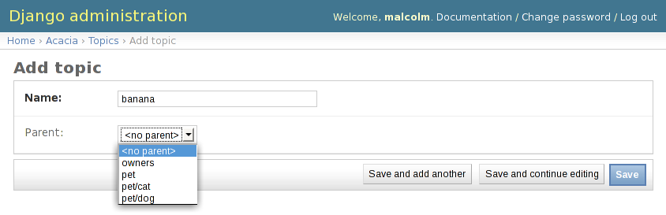

===========
Basic Usage
===========

Adding Topic Classification To A Model
======================================

The most direct usage of Acacia's topic trees is to categorise entries in
another model. You create a ``ForeignKey`` or ``ManyToManyField`` link between
your model and ``acacia.models.Topic`` and use it to store the category (or
categories, in the latter case).

For example, to categorise a series of articles, you might create the following
model:

.. parsed-literal::

    from django.db import models
    **from acacia import models as acacia_models**

    class Author(models.Model):
        ...

    class Article(models.Model):
        title = models.CharField(max_length=150)
        author = models.ForeignKey(Author)
        text = models.FileField(upload_to="%Y%m%d")
        **topics = models.ManyToManyField(acacia_models.Topic)**

That is all that is needed, aside from adding ``acacia`` to the
``INSTALLED_APPS`` tuple in your Django settings file. You can create topics
and assign them to the ``Article`` model in the admin interface or directly in
Python code. These two approaches are covered in the following sections.

In this standard usage, every topic in the topic tree is available for use by
every model that links to the ``acacia.models.Topic`` model. This means you can
use the same categorisation across multiple models. If you want to have
different topics for different models or control the topics that are available
to a model in some other way, refer to the :ref:`advanced-custom-nodes`
section, elsewhere in this documentation.

Working With Topics In The Admin Interface
===========================================

Although the internals of the ``Topic`` model are fairly complex, the admin
interface is very straightforward. For any node in the tree, you can edit its
name and parent.

The *name* of an individual node is the final component of the full name. Thus,
if the node's full name is "timeframe/today/urgent", the name of the node is
"urgent". The parent of that node is the "timeframe/today" node.

Topic nodes are sorted lexicographically by their full name when presented in
the admin. Given the nodes, "pet", "pet/dog", "pet/cat" and "owners", they will
sort in this order::

    owners
    pet
    pet/cat
    pet/dog

This makes finding the appropriate node in a list fairly straightforward, since
all children are grouped together, immediately after their parent.

.. admonition:: Coming Soon

    In the near future, the admin form for working with ``Topic`` objects will
    include a Javascript tree widget for even easier parent selection. With
    even a few dozen topics, the selection list can become quite long and
    unwieldy.

Working With Topics In Django Code
==================================

.. currentmodule:: acacia.models

Selecting Topics
----------------

It will be common ``Acacia`` usage to want to select :class:`Topic` objects
using their full, human-readable names. Those names are natural candidates for
using in URLs and the like, so you need to be able to return from the string
form to the correct object or subtree of objects. In fact, this is the only
reason ``Acacia`` exists as an application, rather than simply using
`treebeard`_ directly: to provide alternative access methods to the individual
nodes.

.. _treebeard: http://code.google.com/p/django-treebeard/

The :class:`Topic` class comes with a default manager (available as
``Topic.objects``) providing some useful utility methods for this purpose. The
``get_by_full_name()`` method is the normal way of retrieving an object, given
its string form::

    Topic.objects.get_by_full_name("animal/cat")

For convenience and consistency repeated separators between name components
(the ``"/"`` character) are collapsed into a single separator. Leading and
trailing separators are also removed. Thus, ``animal//cat`` and
``/animal/cat/`` are both normalised to ``animal/cat``.

If you call ``get_by_full_name()`` and pass in a name that does not exist as a
topic node, a ``Topic.DoesNotExist`` exception is raised. This is similar to
the behaviour of the ``get()`` method in Django's queryset API.

Automatically Creating New Topics
---------------------------------

:class:`Topic` objects can be created using the object's full name. You do not
need to worry about whether the necessary parent node exists, as Acacia will
create any missing ancestor nodes. If a node with the given full name already
exists, a duplicate node is not created. Rather, the existing node is returned
as part of the call. This is all done using ``get_or_create_by_full_name()``::

    node, created = Topic.objects.get_or_create_by_full_name(
            "software/language/python")

The returned ``node`` object is the ``Topic`` object that was requested. The
``created`` value is ``True`` is the ``node`` was newly created and ``False``
is it already existed in the tree. The analogy with Django's queryset`
``get_or_create()`` method should be clear.

